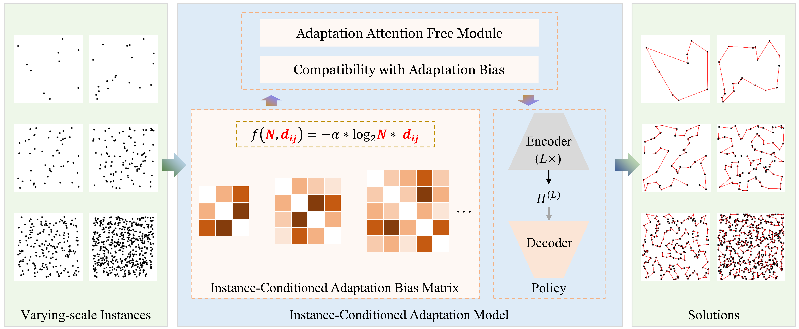

## ICAM (Instance-Conditioned Adaptation Model)


This repository contains the code implementation of paper [Instance-Conditioned Adaptation for Large-scale Generalization of Neural Combinatorial Optimization](https://arxiv.org/abs/2405.01906). In this paper, we propose a powerful RL-based constructive method called ICAM. When facing diverse geometric structures and patterns of instances across different scales, ICAM can effectively capture the instance-specific features (i.e., distance and scale) via the proposed instance-conditioned adaptation function. To make the model better aware of instance-specific information, we incorporate these features into the whole solution construction process (i.e., embedding, attention, and compatibility) via a powerful yet low-complexity instance-conditioned adaptation attention mechanism. Therefore, ICAM can directly generate promising solutions for instances across quite different scales, which improves the large-scale generalization performance for RL-based NCOs.

**You can also find the latest version of our paper at [OpenReview](https://openreview.net/forum?id=gyTkfVYL45).**



### Dependencies
```bash
Python>=3.8
torch==2.0.1
numpy==1.24.4
tqdm
```
We don't use any hard-to-install packages. If any package is missing, just install it following the prompts.

We recommend using PyTorch 2.x for better GPU memory utilization and training (testing) acceleration. This code is trained and tested with PyTorch 2.0.1 (CUDA version 11.7). If you are using PyTorch 1.x, you may encounter OOM (i.e., Out Of Memory) issues even with the same training configuration (unchanged batch_size). For more characteristics of PyTorch 2.x, please refer to the [PyTorch 2.x](https://pytorch.org/get-started/pytorch-2.0/).

Please refer to the official instructions [Previous PyTorch Versions](https://pytorch.org/get-started/previous-versions/) to install the correct version of PyTorch, which is compatible with your CUDA version.

We provide the official instructions to install torch 2.0.1 with CUDA 11.7:
```bash
# CUDA 11.7
pip install torch==2.0.1 torchvision==0.15.2 torchaudio==2.0.2
```

### Implementation

This project's structure is clear, the codes are based on .py files, and they should be easy to read, understand, and run.

The code for each CO problem defaults to retaining the parameters in training the pre-trained model and the parameters used for testing. Please refer to our paper for training and testing settings.

### Model & Data

- Training
  - ICAM is trained using reinforcement learning, and the random data generation method is demonstrated in ten files, such as ICAM_TSP/TSProblemDef.py and ICAM_CVRP/CVRProblemDef.py.
 
- Inference

  - Models: All pre-trained models are placed in `./pretrained`.

  - Data: Please download test sets from Google Drive https://drive.google.com/drive/folders/1B2qBj8rD5apvxaWuBsjOeBStOa_bMQu9?usp=sharing, and place them in `./data`. 

### Further Improvement

We have verified the legality of the corresponding solutions for each problem. We will continue to strive to improve its clarity and welcome any minor errors in the code implementation.

🐛 If there are any issues in running or re-implementing the code, please contact the author Changliang Zhou via email (zhoucl2022@mail.sustech.edu.cn) in a timely manner. 


## Citation

🤩🤩🤩 **If this repository is helpful for your research, please cite our paper:<br />**

```
@article{zhou2024instance,
  title={Instance-conditioned adaptation for large-scale generalization of neural combinatorial optimization},
  author={Zhou, Changliang and Lin, Xi and Wang, Zhenkun and Tong, Xialiang and Yuan, Mingxuan and Zhang, Qingfu},
  journal={arXiv preprint arXiv:2405.01906},
  year={2024}
}
```

## Acknowledgements
The code implementation of ICAM is based on the code of [POMO](https://github.com/yd-kwon/POMO/tree/master/NEW_py_ver) and [MatNet](https://github.com/yd-kwon/MatNet/tree/main/ATSP/ATSP_MatNet).
Thank them for their implementations.


## Copyright (c) 2025 CIAM Group

**The code can only be used for non-commercial purposes. Please contact the authors if you want to use this code for business matters.**
